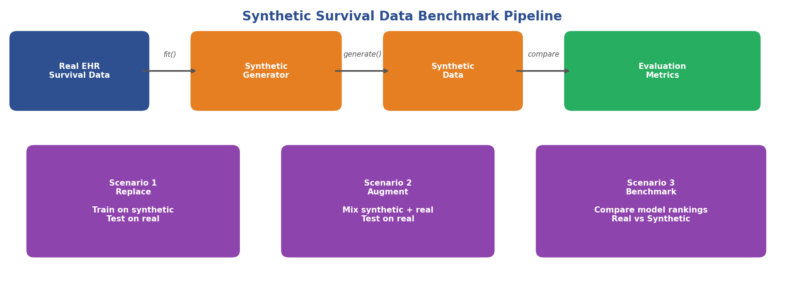
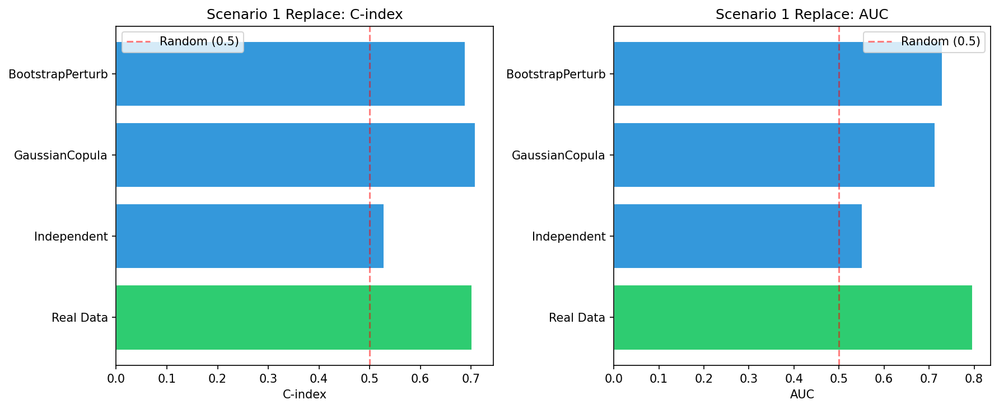
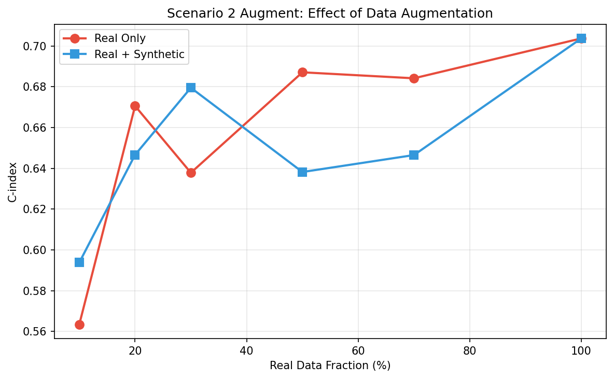
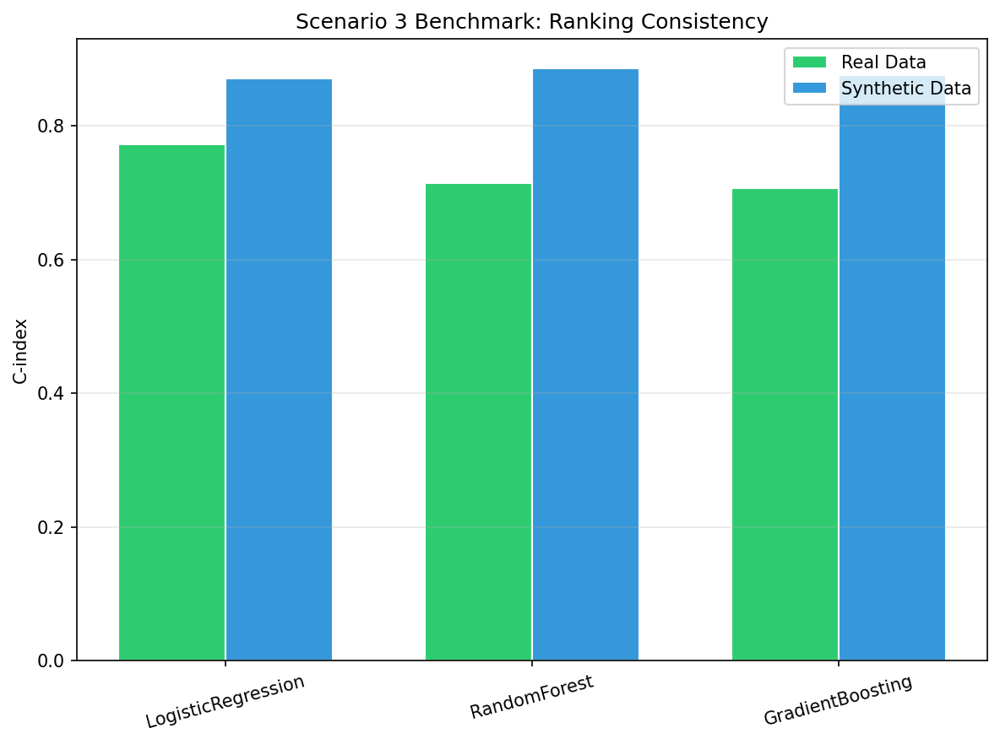
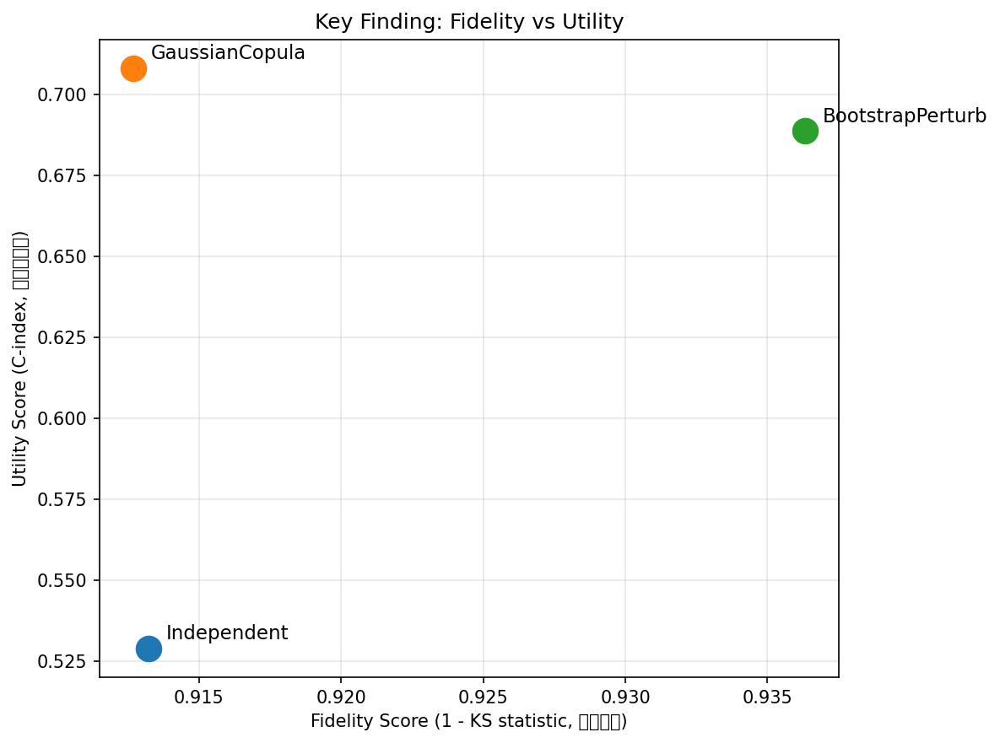

# Synthetic Survival Data Benchmark

A benchmark for evaluating synthetic survival data generation methods on real EHR datasets.

We compare existing synthetic methods and measure whether the generated data is actually useful for downstream survival modeling tasks, not just whether it looks similar to the real data.



## Motivation

EHR survival data (mortality, readmission, graft failure) is valuable but hard to share across institutions due to privacy constraints. Synthetic data is a practical workaround. But generating synthetic data is easy. Knowing whether it is any good is hard.

Current evaluation methods mostly check if the synthetic data "looks like" the real data (fidelity). We also check if the synthetic data "works for the task" (utility). These two can disagree. A dataset that looks great on fidelity metrics can still be useless for training a survival model.

## Three Evaluation Scenarios

We evaluate synthetic data under three usage scenarios. Each scenario has different quality requirements.

| Scenario | Question | Pass Criteria |
|----------|----------|---------------|
| **Replace** | Can I train a model using only synthetic data? | C-index gap < 0.05 vs real data |
| **Augment** | Does adding synthetic data help when real data is scarce? | Positive improvement over real-only |
| **Benchmark** | Does model ranking on synthetic data match ranking on real data? | Kendall tau > 0.5 |

### Scenario 1: Replace

Train downstream survival models on synthetic data only. Test on held-out real data. Compare against the oracle baseline (trained on real data).



### Scenario 2: Augment

Subsample real data at different fractions (10%, 20%, 50%, etc.). Fill up to full size with synthetic data. Check if augmentation helps or hurts.



### Scenario 3: Benchmark

Run multiple survival models on both real and synthetic data. Check if the performance ranking is preserved.



### Fidelity vs Utility

This is the core finding. Fidelity metrics and utility metrics can disagree. A method with worse fidelity can have better utility, and vice versa.



## Methods

We evaluate two categories of synthetic data generation methods.

**Category A: Survival-specific methods.** These methods explicitly model censoring and time-to-event structure.

| Method | Description | Library |
|--------|-------------|---------|
| SurvivalGAN | GAN-based, handles censoring explicitly | synthcity |
| SurVAE | VAE-based survival generator | synthcity |
| Survival CTGAN | CTGAN adapted for survival pipeline | synthcity |
| Survival NFlow | Normalizing flows adapted for survival | synthcity |

**Category B: General-purpose tabular methods.** These methods treat survival data as a regular table.

| Method | Description | Library |
|--------|-------------|---------|
| CTGAN | Conditional Tabular GAN | synthcity / SDV |
| TVAE | Tabular VAE | synthcity / SDV |
| NFlow | Normalizing Flows | synthcity |
| TabDDPM | Tabular Diffusion Model | synthcity |
| GaussianCopula | Copula-based | SDV |

## Evaluation Metrics

Full documentation: [evaluation_metrics.md](evaluation_metrics.md) / [中文版](evaluation_metrics_cn.md)

### Fidelity (does it look real?)

| Metric | What it measures |
|--------|-----------------|
| Log-Rank Test | Overall survival distribution difference |
| Weighted Log-Rank | Early/late survival differences |
| KS Test | Maximum gap between KM curves |
| Lin and Xu Test | Area between KM curves |
| KM Divergence | KM curve distance (from SurvivalGAN) |
| JS Distance | Per-feature distribution distance |
| Correlation Matrix Diff | Whether feature correlations are preserved |
| MMD | Joint distribution distance |

### Utility (does it work?)

| Metric | What it measures |
|--------|-----------------|
| C-index | Discrimination of model trained on synthetic, tested on real |
| Brier Score | Calibration + discrimination combined |

## Data

We use MIMIC-IV ICU data as the primary dataset.

- **Time zero:** ICU admission
- **Event:** Death during ICU stay
- **Censoring:** Discharged alive from ICU
- **Features:** Baseline demographics and clinical variables at ICU admission

MIMIC-III data is also available for transfer learning experiments.

## Setup

```bash
conda create -n survival python=3.10 -y
conda activate survival
conda install xgboost -y
pip install synthcity lifelines scipy
```

## Quick Start

```python
from synthcity.plugins import Plugins
from synthcity.plugins.core.dataloader import SurvivalAnalysisDataLoader
import pandas as pd

# load data
df = pd.read_csv("data/mimic_icu_survival.csv")
data = SurvivalAnalysisDataLoader(df, time_to_event_column="time", target_column="event")

# fit and generate
gen = Plugins().get("survival_gan")
gen.fit(data)
syn = gen.generate(count=1000)
print(syn.dataframe().head())
```

## Project Structure

```
.
├── README.md
├── evaluation_metrics.md        # Metrics documentation (English)
├── evaluation_metrics_cn.md     # Metrics documentation (Chinese)
├── data/                        # MIMIC datasets (not tracked)
├── figures/                     # Plots and diagrams
├── notebooks/                   # Experiment notebooks
│   └── tutorial3_survival_analysis.ipynb
├── pipeline.py                  # Main benchmark pipeline
└── results/                     # Experiment outputs
```

## Team

Department of Biostatistics, University of Michigan

## References

- Qian et al. "Synthcity: facilitating innovative use cases of synthetic data in different data modalities." NeurIPS 2024.
- He, Kevin. *Statistical Learning and Knowledge Distillation for Survival Analysis.* Spring 2026.
- MIMIC-IV: Johnson et al. "MIMIC-IV, a freely accessible electronic health record dataset." Scientific Data, 2023.
